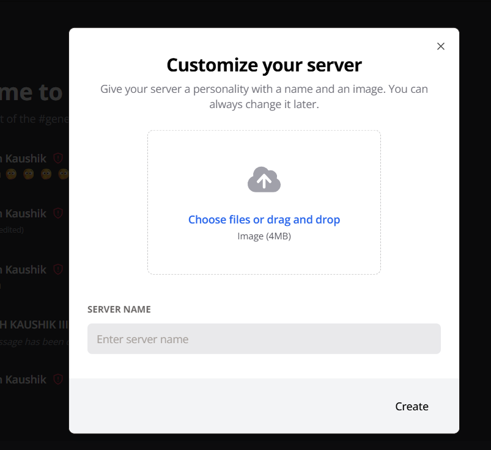
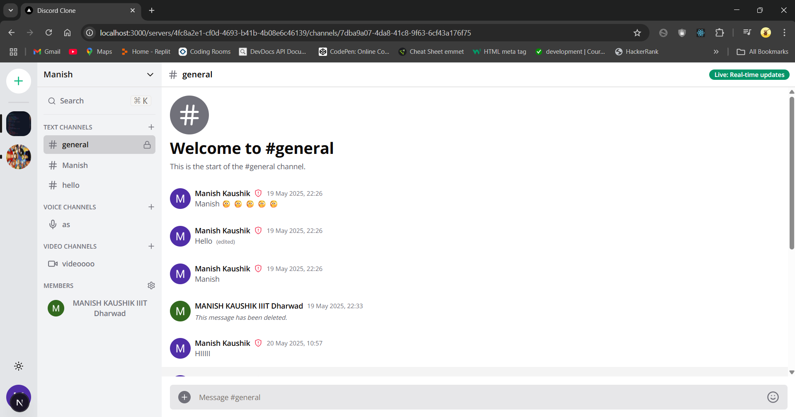
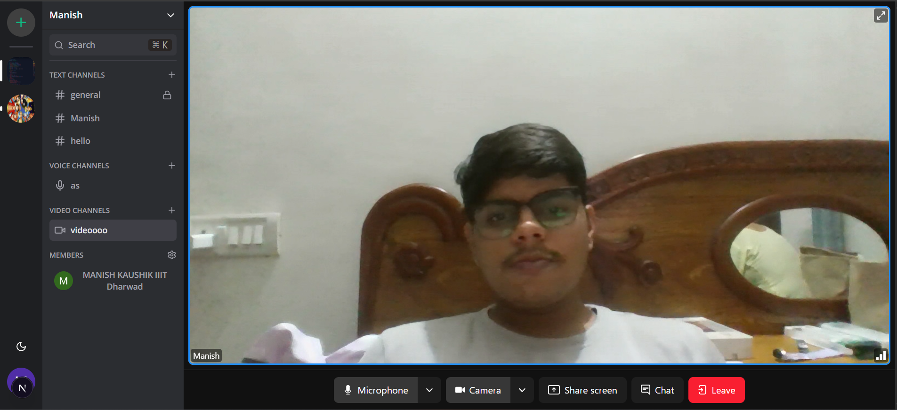

# 💬 ServerTalk – FullStack Collaboration App

A full-featured real-time collaboration platform (Discord Clone) built using:

**Next.js 13**, **React**, **Socket.io**, **Prisma**, **MySQL**, **TailwindCSS**, **TypeScript**, and **Clerk** for authentication.

---

## ✨ Features

- ✅ Client-side validation with `react-hook-form`
- ✅ POST, DELETE, GET routes via Next.js route handlers
- ✅ Real-time messaging with `Socket.io`
- ✅ File sharing via `UploadThing`
- ✅ Edit/Delete messages (live for all users)
- ✅ Create Text, Voice, and Video channels
- ✅ 1-on-1 private messaging
- ✅ 1-on-1 video calling
- ✅ Role management (Guest / Moderator)
- ✅ Invite link generation & invite system
- ✅ Infinite scroll for chat (using `@tanstack/react-query`)
- ✅ Server creation and avatar customization
- ✅ Beautiful responsive UI (TailwindCSS + ShadcnUI)
- ✅ Light / Dark mode toggle
- ✅ WebSocket fallback with polling
- ✅ Database ORM with Prisma
- ✅ MySQL DB hosted on PlanetScale
- ✅ Authentication with Clerk

---

## 📸 Preview

### 🧩 Server Creation and Customization
)


---

### 🖥️ Chat Interface
- Dark & Light modes
- Rich emoji support  



---

### 🔍 Channel & Member Search
Quick navigation using fuzzy search.


---

### 🔐 Sign In with Clerk


---

### 🎥 Video and 🎙️ Voice Calling
- Camera, mic, screen share & chat  



---

## 🧰 Tech Stack

- **Frontend:** React, Next.js 13 (App Router), TailwindCSS, ShadcnUI
- **Backend:** Prisma, MySQL, Next.js Route Handlers
- **Real-time:** Socket.io
- **Auth:** Clerk
- **Media:** LiveKit
- **Storage:** UploadThing
- **Database:** PlanetScale (MySQL)

---

## ⚙️ Prerequisites

- Node.js **v18.x.x**
- A MySQL-compatible DB (PlanetScale recommended)

---

## 🚀 Getting Started

### 1. Clone the Repository

```bash
git clone https://github.com/nayak-nirmalya/discord-clone.git
cd discord-clone


### Prerequisites

**Node version 18.x.x**

### Cloning the repository

```shell
git clone https://github.com/nayak-nirmalya/discord-clone.git
```

### Install packages

```shell
npm install
```

### Setup .env file

```js
NEXT_PUBLIC_CLERK_PUBLISHABLE_KEY=
CLERK_SECRET_KEY=
NEXT_PUBLIC_CLERK_SIGN_IN_URL=
NEXT_PUBLIC_CLERK_SIGN_UP_URL=
NEXT_PUBLIC_CLERK_AFTER_SIGN_IN_URL=
NEXT_PUBLIC_CLERK_AFTER_SIGN_UP_URL=

DATABASE_URL=

UPLOADTHING_SECRET=
UPLOADTHING_APP_ID=

LIVEKIT_API_KEY=
LIVEKIT_API_SECRET=
NEXT_PUBLIC_LIVEKIT_URL=
```

### Setup Prisma

Add MySQL Database (PlanetScale)

```shell
npx prisma generate
npx prisma db push
```

### Start the app

```shell
npm run dev
```

## Available commands

Running commands with npm `npm run [command]`

| command | description                              |
| :------ | :--------------------------------------- |
| `dev`   | Starts a development instance of the app |
| `lint`  | Run lint check                           |
| `build` | Start building app for deployment        |
| `start` | Run build version of app                 |
